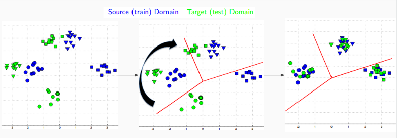

# Domain-invariant_Image_Representations

This provides a python reimplementation of paper [Domain-invariant_Image_Representations](https://people.eecs.berkeley.edu/~jhoffman/papers/Hoffman_ICLR2013.pdf)

* We address the problem of **visual domain adaptation** for transferring object models from one dataset or visual domain to another. 
* There is a significant degradation in the performance of state-of-the-art image classifiers when input feature distributions change due to different image sensors and noise conditions, pose changes more generally, training datasets biased by the way in which they were collected.
* To compensate for statistical differences between domains, **our algorithm learns a linear transformation** that maps points from the target (test) domain to the source (training) domain as part of training the classifier. 

## Getting Started

* You can run the code by running the jupyter notebook [Efficient_Learning_of_Domain-invariant_Image_Representations.ipynb](Efficient_Learning_of_Domain-invariant_Image_Representations.ipynb)
* The data used for the project can be found [here](data)
* Python implementation can be found [here](src)
	* To run the code, use
	    > python run.py <source_domain_id> <target_domain_id>  

	* The dataset we used is Office+Caltech 256. It has 4 different domains with domain ids as follows. :-
		* **1** : Amazon
		* **2** : Webcam
		* **3** : DSLR
		* **4** : Caltech

## Goal

The main goal of this project is to optimize both the transformation and classifier parameters jointly, and introduce an efficient cost function based on misclassification loss.

## Desired Transformation

